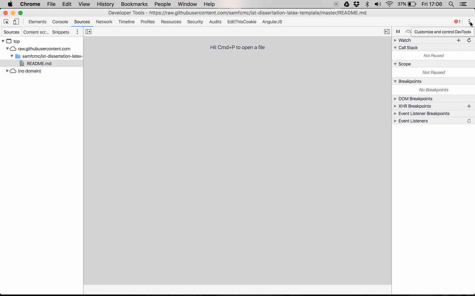

# ionic2_tutorial
Ionic is a framework for mobile development.
It allows you to write apps using web technologies such as
HTML, CSS and Javascript.
However, it is not just an app with a webview loading
your web pages. It does a lot more than that.
It has a lot of optimizations and gives you the look
and feel of a native app like the ones you develop
using Android Studio and XCode.

This tutorial will give you a brief introduction
how to get started with this framework.
Also, there is a small presentation that will
show you the basic concepts.

## Requirements
* [NodeJS](https://nodejs.org/en)
* [NPM](https://www.npmjs.com/)
* [Ionic CLI](http://ionicframework.com/getting-started/)
* [Android SDK](https://developer.android.com/studio/index.html) (If you want to build for Android)
Just install Android Studio because it comes with everything you need
* [XCode](https://developer.apple.com/xcode) (If you want to build for iOS)
* A text editor (My recomendation goes to [VS Code](https://www.visualstudio.com/en-us/products/code-vs.aspx)
which is a pretty nice editor with iteresting features
and it is available for all platforms)

## Getting started
The best way to learn is to get hands on.
In this tutorial, we are going to build a simple
app that will allow the user to create memes, share them
and check memes created by other users of
[Meme Generator](https://memegenerator.net/).

### Installing Ionic Beta
```sh
npm install -g ionic@beta
```

### Creating the project
```sh
ionic start memeapp --v2 --ts
```

The `--v2` option is for creating the project using Ionic V2
instead of V1 which is still the default version.
Beaware that this is a beta version, somethings might not work
as reliable as in the V1. But it is still a nice technology
to try.

The `--ts` option configures the project to use
[Typescript](https://www.typescriptlang.org/), which is a nice language that gives us
static type checking and other stuff that we get from
really good languages, such as Java.

If you never heard of Typescript before take a look
at the website above and read some of their documentation
and look for some examples out there to see how awesome
it is.

This command can take a long time to execute.

When the command finishes its execution we can start
exploring our new project's structure.

### Structure of an Ionic 2 app
#### The `app` folder
Here you have the source code of your app.
All the UI and logic goes here.
Ionic 2 convention is to have all the code related to
a given feature in one folder instead of using
the typical structure of MVC pattern, as in Ionic 1 where
you had the code splitted by type (Models, Views and Controllers)
instead by feature.
From my experience this works much better, specially
in large projects because you can find everything related
to one feature in the same place instead of having
everything splitted in several places, which is a 
big mess!

#### `node_modules` folder
If you are reading this and fullfilled all the requirements
you have now NodeJS installed on your computer.
It uses NPM which is its package manager.
Ionic was built using Node so it is expected that
any project has dependencies installed using NPM.
In this folder you have all the modules required
by the framework and your app.

NOTE: This folder should be in ignore list of your
Version Control System.
If you are using git, make sure you have a `node_modules`
entry in your `.gitignore` file.
If you are using the default Ionic's `.gitignore` file you
don't have to worry about this.

#### `platforms` folder
Here you have the files needed to make your app run in each
platform.

#### `plugins` folder
Ionic framework is based on [Cordova](https://cordova.apache.org)
which is also a framework for mobile development using web
technologies but it is based on plugins.
These plugins allows developers to call native code
from the web code running inside the webview.
Sometimes you have a specific need. For instance,
if you want to make use of the smartphone's camera,
you need to call native code.
You can download a plugin and call it so your code
running in the Webview will be able to call the camera.

The good news is, since Ionic is on top of Cordova,
you can use all these plugins in your Ionic apps.

#### `resources` folder
Here you have all the icons, images and other assets you
need for your app. You can have different resources
for each platform.

#### `typings` folder
If you are using Typescript, you will have this
folder in your project.
Despite of using this language you can still use
all the Javascript libraries you like.
For some libraries you typings definitions which
is a definition of a given interface.
If you are using a Javascript library and
you have a typing definition available you will
allow your text editor (with the right
plugins) to get information about the available
functions and their arguments including their names
and types.
This means that you are using a Javascript library
but still have all the awesomeness of Typescript! 

#### `www` folder
Here you have your index html file and a `build` folder
which holds all the compiled stuff.
This folder is the one that will be served in your
app's Webview.
For instance, when you run `ionic serve` command
it will compile all the Typescript code, copy HTML, etc
and the result will appear here.

#### gulp file
You will notice a `gulpfile.js` file.
The build process of a Ionic 2 app is managed
by [Gulp](http://gulpjs.com/), which is a build tool for Javascript.
You only need to edit this file if you want
to customize something in your build process.

### Run the example app
#### Getting the code
* Clone this repo
```bash
git clone git@github.com:samfcmc/ionic2_tutorial.git
```

* Navigate to the app directory
```bash
cd ionic2_tutorial/memeapp
```

* Install all dependencies
```bash
npm install
```

#### Run the app

You can run the app in multiple platoforms, even in your browser.
This example just has the Android platform but you can
add iOS if you want.

* Run in the browser
```bash
ionic serve
```

* Or, if you prefer an Android emulator
```bash
ionic emulate android
```

* You can use a real device. Connect it throught USB and run:
```bash
ionic run android
```

* If you want to add a new platform you can use `ionic add platform <platform name>`.
For instance, if you want to add iOS run the following:
```bash
ionic add platform ios
```
The previously mentioned commands to `emulate` and `run` in Android
are similar to do the same in ios.
Just replace the word `android` by `ios`.

### Debug
You can debug the app on your browser using
the developer tools of the browser of your choice.
However, if you are using a device or an emulator
you can also debug there.

If you are developing for Android you can achieve this
by using the Developer Tools of Google Chrome browser.

First, run the app on your emulator or device using one
of the following commands:
* Run in an emulator
```bash
ionic emulate android --livereload
```

* Run in a device connected in a USB port
```bash
ionic run android --livereload
```

Now, you open your Google Chrome and open the Developer Tools
<kbd>Ctrl</kbd> + <kbd>Shift</kbd> + <kbd>i</kbd> on 
Windows or Linux
<kbd>Cmd</kbd> + <kbd>Shift</kbd> + <kbd>i</kbd> on Mac.

And then do the following to inspect your device:


## Let´s build!
Did you get excited about this stuff?

Let's build an app to see how awesome is this!!

I will guide you in building a really awesome app that allows
you to scroll through a feed of memes created by
[Meme Generator](https://memegenerator.net) and also
allow the user to create their owns and share them.

First, register an account in Meme Generator web site.
Then... Show up in my presentation!

Have fun :)